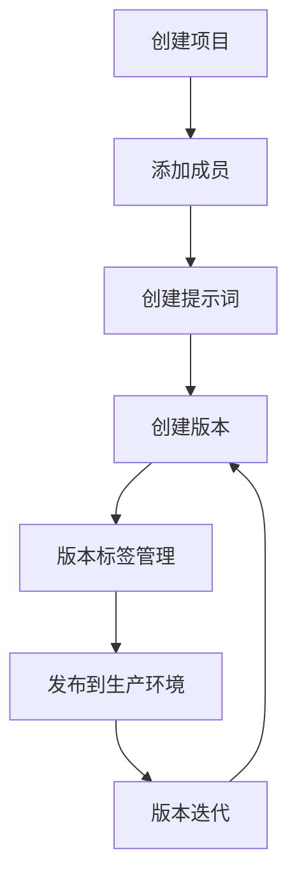
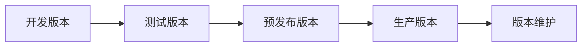
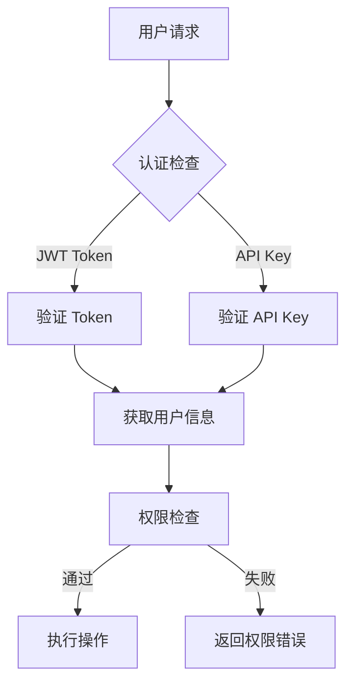
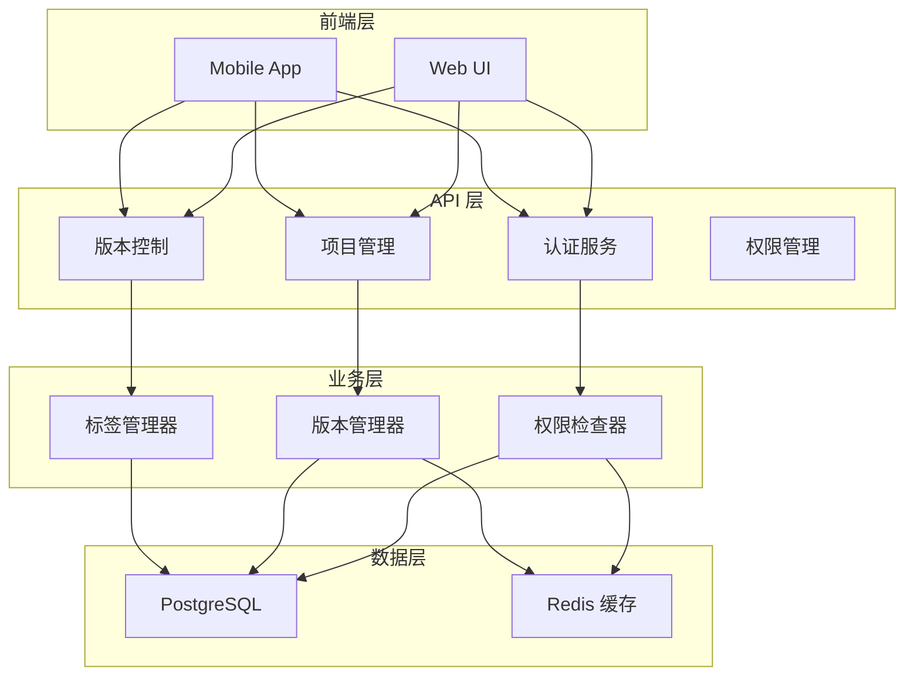
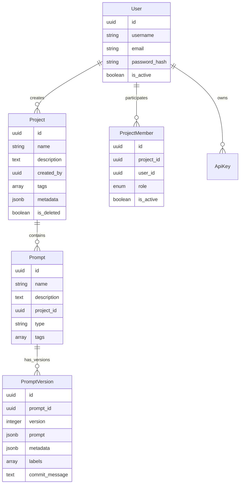

# LangPrompt 设计文档

## 项目概述

LangPrompt 是 Prompt 管理界的 Github + Apollo 的结合。

### 核心组件
- **Server 端**: 用于 Prompt 的管理编辑后端，使用 Python FastAPI
- **前端**: 基于 TypeScript 的用户界面
- **SDK**: 客户端对提示词的使用和管理工具

### 核心特性
- 🔄 **完整的版本管理**: 类似 Git 的版本控制机制
- 🔐 **企业级权限管理**: 多层级角色权限控制
- 🚀 **高性能 API**: 异步处理，支持大规模并发
- 📊 **灵活的元数据**: 支持自定义配置和标签管理

## 设计思路

### 核心概念

**数据层级结构**:
```
项目 (Project)
 └── 提示词 (Prompt)
      └── 版本 (Version)
```

**使用逻辑**:
- **项目** > **提示词** > **提示词版本**
- 提示词名称支持分类命名（如 `category/prompt_name`），类似对象存储的文件夹结构
- 项目可以打标签，标签可以重复使用
- 每个提示词都有独立的版本管理
- 每个版本可以打标签，但同一提示词下的标签具有唯一性

### 版本管理设计原则

#### Git-like 版本不可变性

LangPrompt 采用类似 Git 的版本管理机制，确保版本历史的完整性和可追溯性：

**不可变字段（一旦创建不可修改）**:
- `prompt`: 提示词内容本体
- `version`: 版本号
- `commit_message`: 提交信息
- `created_at`: 创建时间
- `created_by`: 创建者
- `prompt_id`、`project_id`: 关联关系

**可变字段（可以后续更新）**:
- `labels`: 版本标签数组（用于标记 production、staging 等）
- `metadata`: 版本元数据（用于存储额外的配置或信息）
- `updated_at`: 更新时间（自动维护）

#### 版本操作模式

- **创建新版本**: 提交全新的提示词内容，自动递增版本号
- **更新版本标签**: 仅更新版本的标签和元数据，不影响核心内容
- **版本历史保持**: 版本不可删除，保持完整的历史记录

#### Label 管理规则

- **唯一性约束**: 同一个提示词下，每个 label 只能标记一个版本
- **常用标签**: `production`、`staging`、`development`、`deprecated`、`hotfix`
- **标签迁移**: 支持版本间的标签动态调整

### 权限管理架构

#### 认证机制

**双重认证模式**:
- **JWT Token**: Web 端用户认证，支持短期令牌 + 刷新令牌机制
- **API Key**: SDK 和脚本集成认证，支持长期有效性和作用域控制

#### 权限层级

项目级权限管理，支持以下角色层级：

| 角色 | 权限范围 | 具体权限 |
|------|----------|----------|
| **Owner** | 项目所有者 | 项目删除、成员管理、所有读写权限 |
| **Admin** | 项目管理员 | 成员管理、所有读写权限（不能删除项目） |
| **Editor** | 编辑者 | 提示词创建、编辑、版本管理、只读项目信息 |
| **Viewer** | 查看者 | 仅查看项目、提示词和版本，无编辑权限 |

#### 权限控制规则

1. **自动权限分配**: 项目创建者自动成为 Owner
2. **成员管理权限**: 仅 Owner/Admin 可添加/移除成员
3. **角色转让**: 仅 Owner 可转让 Owner 权限
4. **项目删除**: 仅 Owner 可删除项目
5. **API Key 继承**: API Key 继承用户在项目中的最高权限

### 业务流程设计

#### 项目生命周期



#### 版本发布流程



**标签流转示例**:
- 版本 1: `development` → `staging` → `production`
- 版本 2: `development` → `staging`
- 版本 3: `development`

#### 权限验证流程



## 系统架构设计

### 整体架构



### 核心模块

#### 1. 认证与权限模块
- **JWT 处理器**: 令牌生成、验证、刷新
- **API Key 管理**: Key 生成、验证、作用域控制
- **权限检查器**: 统一的权限验证逻辑
- **中间件**: FastAPI 依赖注入集成

#### 2. 版本管理模块
- **版本创建**: 自动版本号递增，内容不可变
- **标签管理**: 版本标签的唯一性控制
- **历史查询**: 版本历史和差异对比
- **元数据管理**: 灵活的配置信息存储

#### 3. 项目管理模块
- **项目 CRUD**: 完整的项目生命周期管理
- **成员管理**: 角色分配和权限控制
- **软删除**: 数据保护和恢复机制

## 数据模型设计

### 核心实体关系



### 版本不可变性设计

**不可变字段**（🔒）:
- 版本内容 (`prompt`)
- 版本号 (`version`)
- 提交信息 (`commit_message`)
- 时间戳 (`created_at`)
- 创建者 (`created_by`)

**可变字段**（✏️）:
- 版本标签 (`labels`)
- 元数据 (`metadata`)
- 更新时间 (`updated_at`)

## API 设计原则

### RESTful 接口规范

**资源命名**:
```
GET    /api/v1/projects                    # 获取项目列表
POST   /api/v1/projects                    # 创建项目
GET    /api/v1/projects/{id}               # 获取项目详情
PUT    /api/v1/projects/{id}               # 更新项目
DELETE /api/v1/projects/{id}               # 删除项目

GET    /api/v1/projects/{id}/prompts       # 获取项目下的提示词
POST   /api/v1/projects/{id}/prompts       # 创建提示词
GET    /api/v1/projects/{id}/prompts/{id}/versions  # 获取版本列表
POST   /api/v1/projects/{id}/prompts/{id}/versions  # 创建新版本
```

### 响应格式标准

**成功响应**:
```json
{
  "success": true,
  "data": {},
  "message": "操作成功"
}
```

**错误响应**:
```json
{
  "success": false,
  "error": {
    "error_code": "PERMISSION_DENIED",
    "message": "权限不足",
    "details": {}
  }
}
```

### 权限注解示例

```python
@router.get("/projects/{project_id}")
async def get_project(
    project_id: UUID,
    current_user: User = Depends(require_project_permission(RoleEnum.VIEWER))
):
    """查看项目 - 需要 Viewer 权限"""
    pass

@router.put("/projects/{project_id}")
async def update_project(
    project_id: UUID,
    current_user: User = Depends(require_project_permission(RoleEnum.ADMIN))
):
    """更新项目 - 需要 Admin 权限"""
    pass
```

## 安全设计

### 认证安全
- **密码安全**: bcrypt 哈希 + 盐值
- **JWT 安全**: 短期访问令牌 + 长期刷新令牌
- **API Key 安全**: 哈希存储 + 作用域限制

### 权限安全
- **最小权限原则**: 用户只能访问必要的资源
- **权限检查**: 每个 API 都有明确的权限要求
- **审计日志**: 记录所有重要操作的日志

### 数据安全
- **软删除**: 重要数据不物理删除
- **数据加密**: 敏感数据传输和存储加密
- **备份策略**: 定期数据备份和恢复测试

## 扩展性设计

### 水平扩展
- **无状态设计**: API 服务无状态，支持多实例部署
- **数据库分片**: 支持按项目或用户进行数据分片
- **缓存策略**: Redis 缓存热点数据

### 功能扩展
- **插件系统**: 支持第三方插件扩展功能
- **模板市场**: 提示词模板共享和复用
- **多语言支持**: 国际化和本地化支持

## 文档体系

本设计文档配套以下技术文档：

1. **[技术实现文档](./技术实现文档.md)** - 详细的技术实现和代码结构
2. **[API 接口文档](./API接口文档.md)** - 完整的 API 使用说明
3. **[数据库设计文档](./数据库设计文档.md)** - 数据库表结构和优化策略
4. **[测试设计文档](./测试设计文档.md)** - 测试策略和自动化测试

## 项目里程碑

### Phase 1: 核心功能 ✅
- 用户认证和权限管理
- 项目管理基础功能
- 版本控制核心逻辑
- 基础 API 接口

### Phase 2: 功能完善 (进行中)
- 提示词管理完整功能
- 版本管理 UI 界面
- 成员管理和协作功能
- 性能优化和安全加固

### Phase 3: 生态建设 (计划中)
- SDK 开发和发布
- 模板市场和社区
- 第三方集成和插件系统
- 企业级特性支持

通过清晰的架构设计和渐进式开发，LangPrompt 将成为 Prompt 管理领域的领先解决方案。